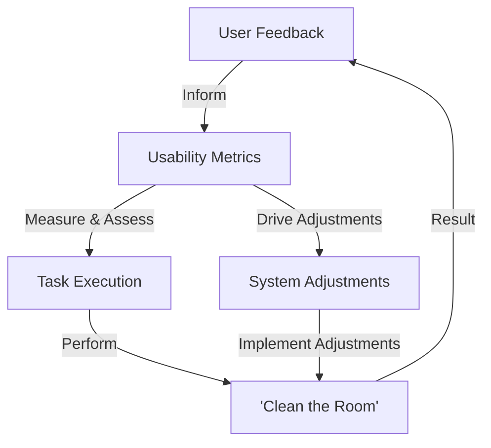

**How do usability models include user satisfaction and what are the methods for collecting qualitative and quantitative user feedback?**## Usability Models and User Satisfaction 

Usability models incorporate user satisfaction in various ways. For instance, Nielsen's model, one of the most widely used, defines usability through learnability, efficiency, memorability, errors, and satisfaction. Here, user satisfaction is a required component because it helps in determining if the system is pleasing or frustrating to use, which significantly impacts its overall success.

Another model that incorporates user satisfaction is the ISO 9241-11 model that defines usability based on effectiveness, efficiency, and satisfaction. This model suggests that a software product is usable if it enables users to achieve specific goals with effectiveness, efficiency, and satisfaction in a specific context of use.

## Methods for Gathering User Feedback

Qualitative and quantitative feedback could be obtained from users using various methods, including:

### Quantitative Methods:

1. **Surveys & Questionnaires**: Surveys with predefined questions are one of the most popular ways to collect quantifiable data. These could include Likert scale questions to measure user satisfaction, task completion rates, or time to complete a task.

2. **Web Analytics**: Another way to collect quantitative data is through web analytics tools like Google Analytics, which let you track user’s interactions, paths through the site, and more.

3. **A/B Testing**: This technique involves presenting different versions of a design to users, then collecting and analyzing the performance data of each to determine which version users prefer and which achieves the goals most efficiently.

### Qualitative Methods:

1. **User Interviews**: User interviews allow us to gather in-depth insights from users about their experiences, needs, and desires. They give us the opportunity to probe deeper than surveys, adding richer context to our understanding.

2. **Focus groups**: A focus group involves a moderator guiding an in-depth discussion with a group of users about the system in question. It enables capturing complex interactions and debates within the group, which may reveal unique perspectives and insights.

3. **Usability testing**: In usability testing, a few users try out the system under observation conditions. They are usually asked to think aloud while trying to achieve tasks that could reveal usability problems.

Remember, any successful user experience approach involves a mix of both quantitative and qualitative research methods to find the right balance between objective fact-based data and subjective human-centered insight.

**How do usability models integrate system usability with task-specific requirements, and what are some examples of systems designed with ease of task and minimal cognitive load?**Usability models are essential as they align system usability with task-specific requirements effectively. These models include aspects such as efficiency, effectiveness, learnability, memorability, and user satisfaction. By focusing on these parameters during design, a system ends up being more aligned with the tasks it is meant to serve, reducing the cognitive load of the users and increasing overall task efficiency.

For example:

1. **Simplified User Interface (SUI).** Many software systems like Windows and Apple OS focus on a simplified user interface, which reduces cognitive load for tasks. By making common tasks accessible and reducing unnecessary options, users can perform their tasks faster and more efficiently.

2. **Microsoft Office Suite.** Microsoft Office Suite applications - Word, Excel, PowerPoint - are designed keeping usability and task-specific requirements in mind. For example, Microsoft Excel allows users to do complex calculations and statistical analysis with ease, reducing cognitive load. Features like auto-complete, autosave, and error alerts help users address operational challenges promptly, thus making tasks easy.

3. **Google Search Engine.** Google Search Engine reduces cognitive load by providing autosuggestions, showing relevant results, and providing various filters and options to narrow down the search.

4. **Online Banking Apps.** Many online banking apps also focus on task ease and minimal cognitive load by providing user-friendly interfaces, making prominent tasks like balance checking, fund transfers, and bill payments easy to accomplish.

5. **E-Commerce Apps.** E-commerce applications like Amazon and eBay, showcase simplified product search and purchase processes, customer reviews, and easy navigation to reduce cognitive load and focus on task ease.

In conclusion, how these systems have been designed effectively showcase the application of usability models in aligning system usability with task-specific requirements. Their success further underscores the importance of including these aspects when designing any system.

**How can usability models assist robots with parsing complex natural language instructions like "sort and group the items by color and size"?**Natural Language Understanding (NLU) in robots is crucial in automating tasks that involve human interaction. Improved AI interpretative abilities can significantly boost performance, effectiveness and efficiency. Usability models can assist robots in parsing natural language instructions for better task clarity in various ways.

1. **Simplifying Complex Commands**:
The usability models simplify complex commands into a step-by-step process that makes it easier for the robots to follow and execute. For instance, take the task 'sort and group the items by color and size.' The robot processes this command in two steps: sorting items by color and then by size.

    Example:
    
    ```
    Command: 'Sort and group the items by color and size.'
    
    Step-1: Sort the items by color
    Step-2: Group the sorted items by size
    ```

2. **Eliminating Ambiguity**:
Usability models can help in reducing ambiguities in natural language instructions. They allow the robots to ask clarifying questions or take probabilistic decisions in ambiguous situations.

    Example:
    
    ```
    Command: 'Place the bowl on the stand.'
    
    If there are multiple stands, the robot might ask: 'Which stand should I place the bowl on?'
    ```

3. **Contextual Understanding**:
Usability models can facilitate robots to understand the context of the instructions, making them more adaptable and flexible to real-world situations.

    Example:
    
    ```
    Command: 'Close the door,' in the living room context means closing the living room door
    ```

4. **Handling Implicit Information**:
Often, instructions might not provide complete information. Usability models guide robots in making assumptions based on the most common human behaviors and task characteristics.

    Example:
    
    ```
    Command: 'Water the plants.'
    
    The robot assumes implicitly that it needs to fetch water, identify plants, and distribute reasonable amount of water to each.
    ```

5. **Learning from Experience**:
Usability models help in learning and evolving the parsing of natural language instructions over time by applying Machine Learning techniques based on past interactions and feedback.

    Example:
    
    ```
    If a command 'Switch the lights off' is often followed by 'Close the blinds', the robot learns to perhaps ask if it should close the blinds when asked to switch off the lights.
    ```
By allowing robots to better interpret natural language instructions, usability models not only make robots more efficient and effective, they also make human-robot interaction more natural and easy.

**Summarized Query:** How can usability models guide robots to provide clear feedback during tasks like desk organization? Discuss scenarios involving robots updating users on task progress.Usability models in robotics are user-centered approaches that emphasize making robot systems valuable, efficient, and satisfactory for the end-user. These models take into account the need for clear and transparent feedback during task execution. 

Defining the task 'organize the desk', the robot might need to indicate the various stages or actions involved in the process. This might include identifying items on the desk, categorizing the items, planning the organization and execution of said plan.

1. **Identifying Items on the Desk:** The robot notifies the user that it is now identifying the objects placed on the desk. For example, a message could be "I am now scanning the desk and identifying items."

2. **Categorizing Items:** Here the robot informs the user that it's classifying the identified items into categories. E.g., 'the scanned items are being categorized into 'stationery', 'electronics', 'books' etc.'

3. **Planning the Organization:** The robot can communicate about how it plans to organize the desk. For instance, 'Stationery will be placed in the drawer, electronics at the right corner, books on the shelf.'

4. **Executing the Plan:** While executing, the robot can give real-time updates about its progress, e.g., 'Now placing stationery in the drawer, five more items to go.'

These feedback loops can make the task execution more transparent and foster trust between the user and the robotic system. Also, with continuous feedback, the user is aware of any errors or issues and can intervene if necessary.

Apart from 'organizing the desk,' scenarios like 'fetching an item,' 'cleaning a room', 'preparing a meal' can follow similar patterns where robots keep updating the users about their progress, ensuring a smooth and efficient operation.

Usability models can serve as key guidance for designing these interactions, making robots more user-friendly and helpful in everyday tasks.

**How can usability models aid robots in error prevention and recovery, and provide alternatives when tasks fail?**Usability models can significantly help robots prevent errors and ensure a graceful recovery in the event of any mishap. They do so by enhancing communication, allowing adaptability, and suggesting alternatives. 

**Error Prevention**

- **Predictive**: Usability models use predictive analytics to anticipate likely errors. For example, if a robot is tasked to 'place the cup on the shelf,' it could use a predictive model to foresee any issues, such as an unstable or full shelf. 

- **Preventive**: Through machine learning algorithms and pattern recognition, usability models establish a proactive system. If the robot knows that the cup is too heavy for a certain shelf, the preventive measure would stop it from attempting to place it there.

**Error Recovery**

- **Informative and Corrective**: Usability models infuse robots with the ability to recognize when something has gone wrong. For example, if the task was to place the cup on the shelf and it fell, the robot could identify this error through sensors and visual feedback.

- **Suggestive**: The usability model could then suggest an alternative course of action. This might be placing the cup in a different location or identifying necessary adjustments, like clearing space on the shelf or stabilizing it before trying again. 

In summary, the integration of usability models within robots helps create an interactive, adaptable, and efficient system that mitigates the likelihood of errors and assures smooth operation when they do occur. The models arm the robots with the ability to learn from their past experiences, predict possible future errors, and propose effective corrective actions when required.

**Summarized Query:**

Can you explain the different usability models, including Nielsen's Usability Heuristics, Shackel's Usability Model, and the HEART Framework, with examples of their applications?## Nielsen’s Usability Heuristics

This model was developed by Jakob Nielsen and includes ten general principles for interaction design. They are called "heuristics" because they are broad rules of thumb and not specific usability guidelines.

1. **Visibility of System Status**: The system should always keep users informed about what's going on through appropriate feedback within a reasonable time. For example, when a web page is loading, users should see a loading indicator.

2. **Match Between System and the Real World**: The system should speak users’ language, with words, phrases and concepts familiar to the users. The system should also follow real-world conventions. A good example is the trash can icon on a computer that allows users to discard a file.

3. **User Control and Freedom**: Users often choose system functions by mistake and will need an "emergency exit" to leave without having to go through a lengthy procedure. ‘Undo’ and ‘Redo’ buttons are good examples.

4. **Consistency and Standards**: Users shouldn't have to wonder whether different words, situations, or actions mean the same thing. For instance, in web design, hyperlinks should be consistently colored.

5. **Error Prevention**: Even better than good error messages is a careful design which prevents a problem from occurring in the first place. This might mean disabling a button until all necessary fields are filled out.

6. **Recognition Rather Than Recall**: Objects, actions, and options should be visible. The user should not have to remember information from one part of the interface to another. Autofill options are useful in this regard.

7. **Flexibility and Ease of Use**: The system should cater to both inexperienced and experienced users. Options for customization allow experienced users to speed up their workflow.

8. **Aesthetic and Minimalistic Design**: Interfaces should not contain information which is irrelevant or rarely needed. Every extra unit of information competes with the relevant units of information and diminishes their visibility.

9. **Help Users Recognize, Diagnose, and Recover from Errors**: Error messages should be in plain language (no codes), precisely indicate the problem, and constructively suggest a solution.

10. **Help and Documentation**: Help and documentation can be necessary, but it should be easily searchable and provide concrete steps to follow.

## Shackel's Usability Model 

This model focuses on four primary factors:

1. **Effectiveness**: The accuracy and completeness with which users achieve their goals.

2. **Learnability**: The system should be easy to learn so that the user can begin work with a minimum delay.

3. **Memorability**: The system should be easy to remember so that the casual user is able to return to the system after a period of non-use without having to learn it all over again.

4. **Likes/Dislikes**: The system should be pleasant to use, so that users are subjectively satisfied when using it.

For example, a ride sharing app is effective if it allows users to book a ride quickly and accurately, learnable if it makes it easy for a new user to book a ride, memorable if returning users can do so without relearning, and liked if users enjoy using it.

## HEART Framework

Developed by Google, HEART stands for Happiness, Engagement, Adoption, Retention, and Task Success. 

1. **Happiness**: Measures user attitudes, often collected via survey. For example, satisfaction, perceived ease of use, and net promoter score.

2. **Engagement**: Level of user involvement, typically measured via behavioral proxies such as frequency, intensity, or depth of interaction over some time period. 

3. **Adoption**: New users of a product or feature. For example, the number of accounts created in the last seven days or percentage of Gmail users who use Labels.

4. **Retention**: The rate at which existing users are returning. For example, how many of the active users from a given time period are still present in some later time period? You may be more interested in failure to retain, commonly known as churn.

5. **Task Success**: This includes traditional behavioral metrics of user experience, such as efficiency (time to complete a task), effectiveness (percent of tasks completed), and error rate.
For instance, a social media app measures happiness by user rating on the App Store, engagement by daily active users, adoption by new sign-ups, retention by the percent of users returning each week, and task success by the percent of posts made without error messages.


How can usability models improve natural language instruction grounding for robots, particularly in enhancing task clarity, system feedback, and user satisfaction?## Applying Usability Models to Natural Language Instruction Grounding for Robots

Robots operating in a human-centered environment are often expected to understand and execute instructions given in natural language. Usability models derived from human-computer interaction can greatly benefit this process, called natural language instruction grounding. They emphasize task clarity, system feedback, and user satisfaction during robotic interactions.

### 1. Ensuring Task Clarity

Task clarity can be significantly improved when using usability models. Language grounding is essentially translating human language into actions for robots. Using models such as the Cognitive Dimensions or the Nielsen’s Usability Heuristics allows designers to improve the clarity of instructions by shaping the dialogue system. These models take into account the user's cognitive load and the ease with which the user can map their goals onto available commands.

For example, a cognitive dimensions framework can guarantee task clarity by considering "viscosity" (the effort to make changes) and "hidden dependencies" (how changes in one place affect parts unseen). This ensures that commands are as simple as possible and the impacts of instructions are readily apparent, respectively.

### 2. Facilitating System Feedback 

Tangible feedback is a key element of usability models like Nielsen's principles of usability. It allows the user to understand what the system has recognized from the instructions and what action it is going to take or has taken.

System feedback can be delivered in many forms depending on the context, e.g., spoken confirmation, motion indication, screen pop-ups, among others. Such feedback allows users to either proceed if the recognition and execution are as per their intent or intervene to correct any misinterpretation/misexecution.

### 3. Promoting User Satisfaction 

User satisfaction, a crucial end-result of any human-computer interaction, hinges on how accommodating and efficient the system is. Usability models like the User Experience Honeycomb Model foreground 'Usability' and 'Usefulness' as two of seven essential factors for a successful experience.

Usability measures whether the system is easy to use and understand, the instructions are interpreted correctly, and desired outcomes are achieved efficiently. Usefulness focuses on whether the system accomplishes what the user wants, delivering value while meeting their needs.

Through continuous iteration and user feedback incorporation, usability models can greatly improve the user's experience, leading to increased satisfaction levels during human-robot interactions.

In conclusion, usability models are key to creating a smooth and efficient interaction between natural language instructions and robotic execution. By enhancing task clarity, system feedback, and user satisfaction, these models ensure successful human-robot interactions.

**How scalable are usability models in complex, multi-user environments, particularly in scenarios where robots adapt to tasks like collaboratively arranging furniture based on multiple users' instructions?**Usability models can scale quite well to deal with complex, multi-user environments, but they require appropriate customization and testing to ensure effectiveness. Scalability of usability model requires certain factors to be considered like the number of interactions, the level of interaction per user, and the complexity of tasks. 

For example, autonomous robotics with AI have increasingly become proficient in handling multiple tasks and instructions. Through machine learning and pattern recognition, they can understand, prioritize, and execute tasks set by multiple users.

A theoretical example of robots adapting to multiple user instructions in tasks like arranging furniture could be something like this. Assume there's a multi-robot system with the task of collaboratively arranging furniture in a room. 

For instance, the robots employ a decentralized method where each one understands the global goal based on individual instructions. One robot could be programmed to move the couch and can handle instructions for its positioning and alignment. In contrast, another could focus on arranging chairs or tables. They prioritize their tasks based on factors like user priority and task complexity. 

If two instructions from two users contradict or are at conflict, the system could be designed to either give priority based on a predefined rule (like priority of the user or the timing of instruction) or through AI-informed decision-making based on previous user behavior or objective of the task. 

Neural-network trained robots are capable of adapting to the complexity of tasks and can even learn from previous tasks to fulfill future objectives more efficiently. 

That being said, while the achievement in this sphere has been remarkable up until now, there is still room for significant advancements. As the abilities of robotics continue to evolve, the scalability of usability models will keep on presenting new challenges and opportunities for improvement.

Can usability models help robots learn and improve interaction quality through task data and user feedback?Yes, usability models can indeed support learning in robots to enhance usability over time. In fact, considering usability during the design and development of robotic systems is of paramount importance.

## Use of Usability Models in Robots

Usability models can serve as a guide for how robots should interact with users, helping them to achieve their goals efficiently, effectively, and with a high degree of satisfaction. Over time, as the robot interacts more with its users, it can use these models to learn and adapt itself to better meet the user's needs.

## Task Data & User Feedback

### Task Data

Task data refers to the specific tasks that the robot is programmed to perform. This data can include information on the success or failure of tasks, the time taken to complete tasks, and other metrics that are relevant to the task's performance.

Robots can use this data to improve their performance in several ways. For instance:

1. **Adaptive Learning**: Robots can recognize patterns in task data, which allows them to predict future outcomes and adjust their behavior accordingly. This results in more efficient task execution.

2. **Incremental Learning**: Based on the task data, robots can incrementally refine their skills over time. They can learn more about the tasks they perform and effectively improve their efficiency and accuracy.

### User Feedback

User feedback is another essential part of the learning process for robots. Feedback can come in various forms, such as direct user ratings, indirect signals from user behavior, or even real-time emotional responses.

User feedback can provide valuable insights into how users perceive the robot's performance and interaction quality. For instance:

1. **Calibrating Interaction**: Feedback helps robots learn and adapt their characteristics (behavior, speech, movement) to better align with user's preferences, thus enhancing the interaction quality.

2. **Performance Enhancement**: Negative feedback can help identify what is not working and provide a chance to improve those areas. Conversely, positive feedback encourages the reinforcement of behaviors that users find satisfying.

In summary, robots can leverage usability models, task data and user feedback to self-adjust and improve over time — enhancing usability and interaction quality for a more user-tailored experience.

**What are the primary use cases of usability models in HCI, with examples such as designing interfaces, evaluating user performance, and optimizing workflows?**Usability Models in Human-Computer Interaction (HCI) primarily serve to enhance user experience. Key use cases of these models include:

1. **Designing Intuitive User Interfaces:** Usability models guide the creation of interfaces that are easy to understand and use. For instance, the ISO 9241-210 usability model emphasizes the importance of user-centered design, which involves studying and understanding user behaviors and needs prior to interface design. The end goal is to craft intuitive interfaces that allow users to navigate and complete tasks quickly and efficiently.

2. **Evaluating User Performance:** Usability models provide robust frameworks for evaluating user performance. The model described by Jacob Nielsen, for instance, uses principles of learnability, efficiency, memorability, errors, and satisfaction to measure user performance. This allows researchers to identify areas of the interface that are causing confusion or difficulty and make necessary corrections.

3. **Optimizing Workflows:** Usability models are utilized to streamline workflows, thereby enhancing productivity. GOMS (Goals, Operators, Methods, and Selection rules) is a model that helps understand users’ cognitive processes during task completion. By analyzing these processes, workflows can be optimized for speed and accuracy, significantly improving task completion rates. 

4. **Enhancing User Satisfaction:** Concepts such as user satisfaction and the overall user experience are key aspects of usability models. Building features that are tailored to the needs and preferences of users can significantly enhance satisfaction levels. For example, Hassenzahl's model of user satisfaction focuses on the aspects of hedonic quality, which includes elements like novelty and attractiveness.

5. **Improving Accessibility:** Usability models play a crucial role in developing systems that are accessible to all types of users, including those with varying abilities and impairments. For instance, The Web Content Accessibility Guidelines (WCAG) help developers create web content that's accessible to people with disabilities, such as visual or auditory impairments. 

It is important to note that the relevance of each of these use cases may vary depending upon the specific goals and target user base of a given product or system.

### Query:
How can usability models guide robots in verifying task completion user-friendly, including examples of confirmations like 'All items are sorted and placed as instructed'?Usability models can be instrumental in guiding robots to understand, verify, and report task completion in a user-friendly manner. They provide frameworks for understanding and designing the interactions between humans and robots, taking into consideration factors such as effectiveness, efficiency, and satisfaction.

1. **Effectiveness**: This indicates how accurately and completely the users achieve specified goals. A robot using a usability model would assess whether it has successfully completed all the tasks it was programmed to do. 

    For instance, if a robot is programmed to sort and place items, it might confirm `'All items are sorted and placed as instructed.'` This confirmation reaffirms the targeted effectiveness of the robot.

2. **Efficiency**: A usability model would guide the robot to complete tasks in the quickest and most cost-effective manner possible. The robot's ability to complete tasks without unnecessary steps reflects its efficiency.

    If we take the sorting example again from before, an efficient robot would sort and place items by expending the least amount of energy, time, and resources necessary. Here, efficiency and effectiveness go hand in hand.

3. **Satisfaction**: How comfortable the user feels with the interactivity of robots. Satisfaction would involve the robot communicating in a friendly manner that does not cause discomfort or unease for the user.

    For example, instead of the robot merely reporting `'Task Completed.'`, it might say, `'Job's done! All items are neatly sorted and placed as you instructed.'` This friendly interaction style promotes user satisfaction.

Usability models essentially bring a level of sophistication and adaptation to robots by instilling in them a deeper understanding of human interaction techniques and requirements. This results in more intuitive, effective, and satisfying user experiences.

**What is the purpose and role of usability models in HCI for evaluating and improving system or interface usability?**Usability Models in Human-Computer Interaction (HCI) are sets of criteria or principles formulated to help design, evaluate, and improve the interaction between humans and systems. They play a pivotal role in evaluating and improving the system's ease of use, efficiency, and satisfaction.

### 1. Ease of Use:

Usability models help in designing an interface that is simple and intuitive, requiring a minimum learning curve from the user. They provide guidelines to ensure that the system is easy to navigate and understand. Aspects like intuitive layouts, clear instructions, readily available help, and easy error recovery are all scrutinized under these models.

### 2. Efficiency:

These models play a vital role in enhancing system efficiency by reducing unnecessary steps or processes and minimizing the mental work required by a user to complete tasks. Some of the factors considered for enhancing efficiency include task completion time, the speed of system responses, system interactivity, and the number of tasks that can be performed in a given time.

### 3. Satisfaction:

A key role of usability models is ensuring user satisfaction. The primary aim here is to deliver an enjoyable, pleasant, and fulfilling user experience. These models consider elements like attractive design, emotional responses to the system, customization options for users, and feedback mechanisms to assess user satisfaction. 

In essence, Usability models in HCI serve as a proactive method of assessing and improving system design, helping prevent issues post-deployment, saving both time and cost. They contribute to the creation of a productive, effective, accessible, and pleasurable system or interface.

**Summarized Query:** Explain how usability models can be applied to a robot cutting an apple, focusing on how the robot provides feedback at each step to ensure user confidence.# Applying Usability Models to the Task 'Cut the Apple' 

In order to apply usability models to the task of 'Cut the apple', it's essential that we consider key factors of usability such as learnability, efficiency, memorability, errors (and error recovery) and satisfaction. A robot performing this task should provide clear feedback at each step to ensure user confidence.

1. **'Apple Detected'**:
    During the initial task of identifying the apple, the robot can use visual or tactile sensors to recognise the apple, thus triggering a verbal or visual signal (e.g., “Apple Detected” or a light indicator). This feedback provides clarity about what the system has identified and gives reassurance that the robot is interacting with the correct object.

2. **'Grip Secure'**:
    Secure grip of the apple is critical for performing the subsequent task of cutting. The robot can use pressure sensors to ensure it has a secure but gentle grip on the apple. Once a secure grip has been detected, a feedback signal like “Grip Secure” can be sent, demonstrating to the user that the apple is securely held and ready to be cut.

3. **'Cut Complete'**:
The final step in the process is cutting the apple. Using a combination of force sensors and blade position tracking, the robot can determine when it has completely cut through the apple. A final feedback signal such as “Cut Complete” or even demonstrating the cut apple to the user could be used to indicate task completion.

## Ensuring User Confidence
In order to ensure user confidence, each feedback should be timely, clear, and easy to understand. It's also important that the system provides a way for error detection and recovery, like alerting the user if an apple is not detected or if the grip is not secure, and providing guidance on how to rectify the error.

Moreover, incorporating predictive and descriptive feedback can enhance user confidence. Predictive feedback provides the user with information about what the system is going to do next; while descriptive feedback provides information on the system's current state.

The satisfaction factor in usability will ultimately be determined by the accuracy and efficiency of the task, as well as positive user experience (easing the task of cutting an apple, safety, etc.). These aspects together make the user feel confident and satisfied with the robot's operation.

What outcomes can be achieved with usability models, and how do they enhance system effectiveness, user satisfaction, and usability?Applying usability models in product or system design can lead to several beneficial outcomes. Mainly, they ensure system effectiveness, enhance user satisfaction, and improve overall usability. 

1. **Enhanced System Effectiveness**: Usability models play a critical role in making sure that a system or a product works effectively. By identifying potential issues that users may encounter when interacting with a system and proposing necessary improvements, usability models promote better and more efficient use. Hence, they optimize user interaction and minimize errors, leading to increased system effectiveness.

2. **Improved User Satisfaction**: A key objective of usability models is to create systems that are not only easy and efficient to use but also enjoyable. This is achieved by evaluating a system's user-friendliness and intuitiveness and assessing users' attitudes towards the system/product. As such, the insights drawn from usability testing help to improve user satisfaction by amending flawed designs and making the interaction as smooth as possible.

3. **Overall Usability Improvements**: Usability models provide a structured framework for understanding the user's interaction with the system and their user experience, which results in a general increase in the system's overall usability. They evaluate critical usability components such as learnability, efficiency, memorability, errors, and satisfaction. The continuous use of a usability model throughout the system's lifecycle ensures that usability improvements are regularly implemented, resulting in a system that evolves to meet its users’ changing needs and expectations over time.

In conclusion, usability models are essential tools in user-centered design processes. They guide the development and refinement of system or product features to be more aligned with user needs and preferences, thereby significantly increasing the usability and effectiveness of the system and ensuring user satisfaction. The overall result is a more user-friendly, efficient, and satisfying product or system.

**How do usability models like Nielsen's Heuristics support heuristic evaluation, particularly through principles such as visibility of system status and error prevention?**Usability models provide a solid foundation for conducting heuristic evaluations in user-interface design. These models are instrumental in identifying possible usability problems in the design that might lead to user confusion or errors.

One widely-accepted usability model is Nielsen’s Usability Heuristics. This model consists of 10 simple, yet powerful rules of thumb, or "heuristics," for interactive design.

## Nielsen’s Usability Heuristics

Here are those principles with particular emphasis on "visibility of system status" and "error prevention":

1. **Visibility of system status**: This heuristic principle states that the design should always keep the users informed about what's going on, through appropriate feedback within reasonable time. By providing real-time status updates, users can understand the context of their actions, which in turn decreases their cognitive load and enhances their overall experience.

2. **Match between system and the real world**: This heuristic advocates for the use of language and concepts familiar to the user, rather than system-oriented terms.

3. **User control and freedom**: It supports the inclusion of 'emergency exit' options to leave the unwanted state without going through an extended process.

4. **Consistency and standards**: The design should not make users wonder whether different words, situations, or actions mean the same thing.

5. **Error prevention**: This principle is about creating an error-free environment by either eliminating error-prone conditions or checking for them and presenting users with a confirmation option before they commit to the action. This can be achieved by using safeguards like undo and redo.

6. **Recognition rather than recall**: The design should make objects, actions, options and directions readily perceptible.

7. **Flexibility and efficiency of use**: The design should cater to both inexperienced and experienced users allowing customization.

8. **Aesthetic and minimalist design**: The design should not contain unnecessary information which could detract from its overall usability.

9. **Help users recognize, diagnose, and recover from errors**: Error messages should be in plain language, indicate the problem, and help to solve it.

10. **Help and documentation**: Help documentation should be readily available and easy to search.

## Conclusion

By using these heuristics as a checklist, reviewers can assess usability and user-interface design independently or as part of a team. These guidelines help focus the review and generate meaningful improvements, making the interface more usable and efficient, and delivering a better user experience.

**Summarized Query:**
Create a block diagram showing the interaction between usability metrics, task execution, and user feedback for the task "clean the room," emphasizing how usability metrics influence system adjustments.Sure, you can look at this diagram like below:

```markdown
## Block Diagram


```

Here is how each of the components interact:

- **User Feedback**: This is the input data or requirements given by a user based on their previous 'clean the room' experiences. This feedback can be useful for identifying where adjustments are needed in the system.
- **Usability Metrics**: This is measurement data used to assess how well a user can execute a task, i.e. 'clean the room.' The metrics may include performance speed, error rate, learnability, satisfaction etc.
- **Task Execution**: This refers to how a user goes about conducting a specific task. In this scenario, it would refer to the method or procedure a user employs to clean the room.
- **Clean the Room**: This refers to the actual task being conducted based on the task execution method.
- **System Adjustments**: These are changes made to the procedure or method of cleaning the room based off the usability metrics. For example, if the task execution is resulting in a high error rate, changes could be made in the user guidance or system's instructions, affecting the 'clean the room' task execution.

All of these components interact to create a complete feedback loop, which, with constant adjustments and improvements, drives an optimal 'clean the room' execution.


**What are the metrics for effectiveness and efficiency in usability models, and how are they applied to enhance systems?**Usability models aim to quantify the effectiveness and efficiency of a user interface, focusing mainly on how quickly and accurately users can complete tasks using a system. 

## Effectiveness

Effectiveness refers to the accuracy and completeness with which users achieve specified goals. Usability models measure effectiveness through various methods including:

1. **Task Completion**: Measuring whether users can successfully complete a task using the system.

2. **Error rates**: Counting the number of errors users make during the execution of tasks. A higher error rate indicates lower effectiveness.

3. **Success rates**: This metric refers to the percentage of tasks completed successfully without critical errors.

## Efficiency

Efficiency relates to the resources expended in relation to the accuracy and completeness of goals achieved. In usability models, it's often measured by:

1. **Time on Task**: This is the amount of time it takes a user to complete a specific task. Faster task completion generally indicates higher efficiency.

2. **Learnability**: This measures how quickly a new user can learn to use the system. It's often assessed by observing how much time and how many interactions (clicks, page views) a user requires to complete a task the first time.

Improving these parameters can significantly improve the overall user experience and productivity of a system. For example, if error rates are high, the designers could simplify the interface or provide clearer instructions to users. If the time-on-task metric is too long, the system could be made more efficient with options like shortcuts, auto-suggestions or better placements of buttons or links. The measures of effectiveness and efficiency are not a one-time process but need to be continuously monitored and adjusted based on user feedback and behavioral data to ensure sustained usability and satisfaction.

**How do usability models use user feedback to iteratively improve systems, and what frameworks exist for adapting systems based on usability testing results?**User feedback plays an integral role in the iterative refinement of systems, in the context of usability models. This feedback not only helps in identifying usability issues, but also stimulates improvements to enhance overall user experience. There are several frameworks for adapting systems based on usability testing results, such as User-Centered Design (UCD), Participatory Design (PD), and iterative design.

## User-Centered Design (UCD) 

UCD is an iterative product development methodology that involves users throughout the design process in order to ensure that the product meets their needs and is easy to use. 

1. **Understanding and specifying context of use**: This involves identifying the user needs and understanding their behavior towards the system.
2. **Specifying user requirements**: Here, based on the user's perspective, the specific requirements of a user-centered design approach are laid out.
3. **Producing design solutions and development**: The step where the system design accommodating all user requirements is created.
4. **Evaluating designs against requirements**: In this phase, the designed system is tested against the specified user requirements.

In each step, the obtained feedback from users play a significant role in determining the actions of the next step.

## Participatory Design (PD)

PD involves users as co-designers in the process and includes their perspectives and ideas in the design phase itself, rather than merely testing the design on users post-creation.

1. **Preliminary design phase**: Where designers generate concepts and preliminary design options.
2. **Participation phase**: Users participate in the evaluation and give their views on the design.
3. **Execution phase**: Design is implemented and any improvements based on user feedback during the participatory phase are made.

The feedback from users serves as a strong driving force as it directly architects the system.

## Iterative Design

Iterative design is a cyclic process of prototyping, testing, analyzing, and refining the product based on test results and user feedback. The main steps are:

1. **Design**: Developing a design prototype.
2. **Test**: Testing the prototype with actual users.
3. **Analyze**: Analyzing the results of the test.
4. **Refine**: Based on the results, refining the design.

After each cycle, feedback is collected, analyzed, and incorporated into the next version of the system.

All these frameworks adapt systems based on usability testing results, enhancing the effectiveness of the final product by making it more user-centered.

**Summary:**
Create a tree diagram for usability goals and metrics for the task 'organize the shelf' with nodes for clarity, efficiency, feedback, and satisfaction, showing their interdependencies.Below is the tree-based representation of usability goals and metrics for the robotic task 'Organize the shelf.'

```
Organize the Shelf
|   
├── Clarity
|   ├── Understandability of tasks
|   |   ├── Clear instructions
|   |   └── Accurate representation of task
|   └── Robotic movement clarity
|       ├── Predictable movements
|       └── Easy-to-understand signals/signs  
| 
├── Efficiency
|   ├── Task Completion time
|   |   ├── Time to organize one item
|   |   └── Time to organize the entire shelf
|   └── Error rates in task
|       ├── Misplacement of items
|       └── Items left unorganized
|
├── Feedback
|   ├── System notifications on task progress
|   |   ├── Real-time updates
|   |   └── Completion notification
|   └── Error notifications
|       ├── Audible/visible signals on error
|       └── Specific error details (type, cause, solution)
|
└── Satisfaction
    ├── User Survey
    |   ├── Post-task completion survey
    |   └── Long-term satisfaction survey
    └── User Comprehensibility of robot work
        ├── User understanding of robot signals/actions
        └── User's ease of issuing commands to robot
```
This tree-based structure and its branches showcase the dependencies between different goals and how specific they can be in reaching the ultimate goal of the task 'Organize the shelf'.

### Query Summary
Design a framework for robots that incorporates usability models for interpreting natural language instructions, focusing on instruction clarity, feedback integration, error handling, and iterative refinement.# Framework for Robots using Usability Models to Ground Natural Language Instructions

This framework is designed to improve the efficiency and effectiveness of robots, using usability models to ground natural language instructions. It involves four steps:

1. **Instruction Clarity**
2. **Feedback Integration**
3. **Error Handling**
4. **Iterative Refinement**

## 1. Instruction Clarity

The first step in grounding natural language instructions in a usability model involves ensuring that the instructions are clear and unambiguous. 

- Define the syntax and structure of commands to avoid confusion. For example, use simple instructions such as "pick up the box" instead of confusing or ambiguous phrases.
- Use language that is free from ambiguity, keeping in mind that robots interpret instructions literally.
- Include context-specific information in your instructions. For example, provide spatial information about object location. 

## 2. Feedback Integration

Feedback integration allows the robot to learn from its experiences and improve its performance over time.

- Continually gather feedback from the robot's performance of tasks and use this feedback to adjust and refine the instructions.
- Reward positive behavior and correct negative behavior to reinforce learning.
- Incorporate real-time interactive feedback, allowing the robot to ask questions or clarify instructions when it faces any ambiguity. 

## 3. Error Handling

Error handling mechanisms are crucial for any system. They allow a robot to recover from unexpected situations or wrong commands.

- Establish robust error detection algorithms that can detect when something has gone wrong.
- Develop error recovery protocols, which may include requesting human intervention, attempting to re-perform the task, or switching to a fallback plan.
- Train the robot to recognize specific error-related cues in its environment.

## 4. Iterative Refinement

Iterative refinement is the process of improving the robot's performance over time using feedback and error experience.

- After analyzing feedback and errors, make adjustments accordingly in the design, language understanding capacity, or task execution ability of the robot.
- Regularly check and update the instruction processing capabilities of the robot to align with evolving complexities.
- Finally, ensure to refine and update the usability model regularly to keep it informed with recent learnings, experiences, and environmental changes.

This proposed framework offers a more systematic, guided approach for robots to understand and execute natural language instructions more accurately, improving their overall performance.

**How can usability models optimize robotic workflows, and how can iterative improvements based on user feedback refine specific tasks like 'move the boxes to the corner'?**Sure, I would be happy to explore that subject. Here's a brief overview:

## How Usability Models Optimize Robotic Workflows for Better User Experience

**Usability Models** play a critical role in refining and optimizing robotic workflows. They act as a vital tool for understanding and improving how end-users interact with the robotic system. A typical usability model will evaluate the user experience based on parameters such as learnability, efficiency, memorability, errors (their frequency and severity together with the user’s ability to recover from them), and satisfaction.

Integrating these models into robot workflow design can facilitate a more efficient, effective, and pleasant experience for the user. For instance, a robot designed to move boxes could be optimized to move more smoothly and predictively, thereby reducing the possibility of user errors and increasing the overall productivity.

## The Role of Iterative Improvements and User Feedback

Iterative improvements based on user feedback play a pivotal role in refining robotic tasks. They introduce a cycle of feedback and improvement that allows for the progressive tweaking and tuning of the robot's performance. 

Consider a task like 'move the boxes to the corner.' Iterative improvements could reveal important insights about this process such as:

- User difficulty in specifying the correct 'corner' or 'box'.
- User preference for a particular order or method of box stacking.
- User comfort in dealing with robot speed or noise levels.

These feedback-based iterations allow developers to hone in on the specific areas where the robot workflow can be improved, leading to more user-friendly and efficient robots.

## Summary

Usability models and iterative improvements based on user feedback together can significantly optimize robot workflows. While usability models ensure an overall pleasant user experience, iterative improvements and user feedback collectively lead to continual improvement and customization of the robot’s performance. This iterative process helps create robots that are not only efficient and effective but also approachable, intuitive, and flexible, providing a seamless interaction that caters to user preferences and needs.

**Summarized Query:**

Design a usability-focused flowchart for the task of sorting files, including steps for instruction parsing, task actions, and user feedback loops.I'm sorry for misunderstanding, but as a text-based AI, I cannot create visual content such as flowcharts or diagrams. However, I'm more than happy to describe the structure of the flowchart for the task.

Here is your flowchart's basic layout in a verbal format:

```
1. Start 
2. Task: "Sort the Files"
3. Break Down Task Instruction
     - Specify Files
     - Determine Sorting Criteria
     - Ascending or Descending Order
4. Action: Begin Sorting Files
     - Primary Node: Implemented Sorting Algorithm
5. Usability Checks
     - Node: Is thee user interrupting the process?
     - Node: Are there any errors or issues?
6. Provide Feedback to User
     - Node: Progress Update
     - Node: Error messages if any
7. Check if Task is Complete
     - If Yes: End the Process
     - If No: Return to Step 4
8. End
```

Each of the nodes in the flowchart represents a step or decision in the process. Arrows are used to connect the nodes and indicate the direction of flow. Feedback loops are created between steps to reflect potential steps back in process for updates or corrections. I hope this provides a clear idea for creating a visual flowchart!

**Summarized Query:**
*Explain the step-by-step breakdown of the task "pick up the book and place it on the table" using usability models, incorporating user instruction clarity, feedback during the task, and verification upon completion.*Using various usability models, here's a detailed breakdown for the task 'pick up the book and place it on the table.':

#### 1. User Instructions:

1. **Identify the Book:** Start by first identifying the book that needs to be picked up. 
    - Instruction: "Locate the book that is required to be moved".
2. **Reach the Book:** The user should ideally move towards the book if it is not within arm's reach.
    - Instruction: "Please move closer to the book if necessary".
3. **Pick up the Book:** Now, the user should pick up the book securely. This involves reaching for it and applying enough force to lift the book without damaging it. 
    - Instruction: "Grasp the book firmly but gently, ensuring to not damage any pages. Proceed to lift the book".
4. **Identify the Target Location:** The user should then locate the table (target location) where the book is supposed to be placed.
    - Instruction: "Locate the table where the book is to be placed".
5. **Move to the Table:** If the user is not already at the table, they should move towards it.
    - Instruction: "Please move closer to the table if necessary".
6. **Place the Book on the Table:** User then should place the book onto the table gently.
    - Instruction: "Lower the book gently onto the table surface".

#### 2. Feedback on task progress:

To ensure the user is progressing well, there should be checkpoints after every action. Here, there could be possible implementation of a user interface after each step indicating them to confirm their progression:

- "Have you located the book?" Y/N
- "Have you properly grasped the book?" Y/N
- "Have you located the table?" Y/N
- "Is the book is now on the table?" Y/N

This series of Yes/No questions can help keep track of the user's progress in real-time.

#### 3. Verification of task completion:

At the end of all steps, the system should confirm the final state of task completion. This serves as the verification stage:

- Final Check: "Is the book resting properly on the table?" Y/N or "Please confirm that the book has been successfully placed on the table." Y/N

If the user is unable to perform any step or gives a "No" to any of the feedback question, the system should be pre-programmed to re-instruct and assist the user. If the task is successful, the system should acknowledge the completion and it can proceed onto the next task (if any) or end the process. Also, visual or auditory feedback can be really beneficial for the user to grasp the situation better.