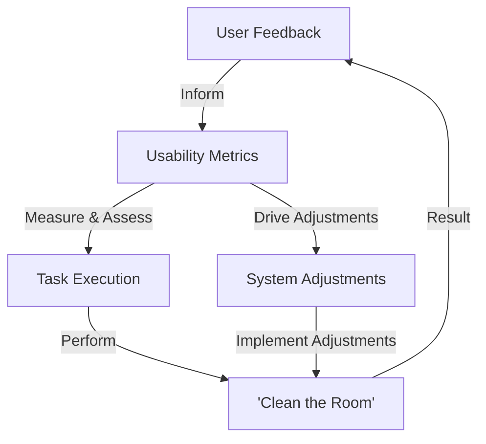

**Summarized Query:**
Create a block diagram showing the interaction between usability metrics, task execution, and user feedback for the task "clean the room," emphasizing how usability metrics influence system adjustments.Sure, you can look at this diagram like below:

```markdown
## Block Diagram


```

Here is how each of the components interact:

- **User Feedback**: This is the input data or requirements given by a user based on their previous 'clean the room' experiences. This feedback can be useful for identifying where adjustments are needed in the system.
- **Usability Metrics**: This is measurement data used to assess how well a user can execute a task, i.e. 'clean the room.' The metrics may include performance speed, error rate, learnability, satisfaction etc.
- **Task Execution**: This refers to how a user goes about conducting a specific task. In this scenario, it would refer to the method or procedure a user employs to clean the room.
- **Clean the Room**: This refers to the actual task being conducted based on the task execution method.
- **System Adjustments**: These are changes made to the procedure or method of cleaning the room based off the usability metrics. For example, if the task execution is resulting in a high error rate, changes could be made in the user guidance or system's instructions, affecting the 'clean the room' task execution.

All of these components interact to create a complete feedback loop, which, with constant adjustments and improvements, drives an optimal 'clean the room' execution.

